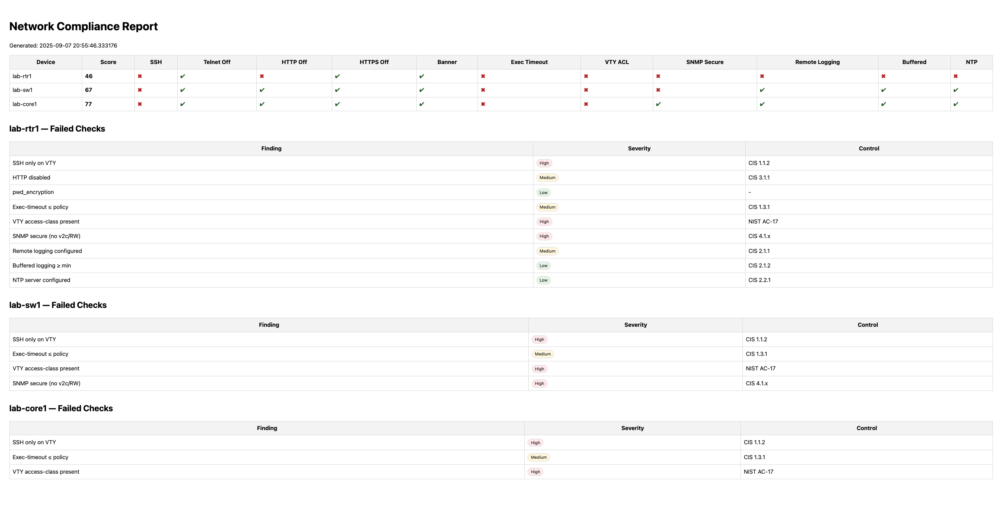
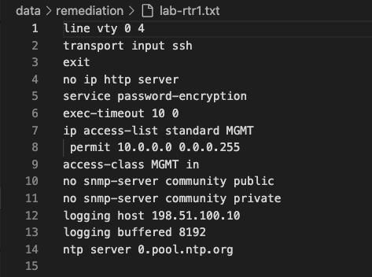
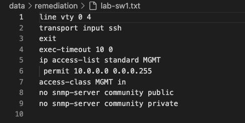
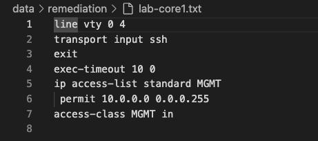

# 🛡️ Python Cisco Compliance Toolkit

A Python-based toolkit that **audits Cisco IOS configuration files**, generates **HTML compliance reports**, and exports **remediation commands** to fix misconfigurations.  
This project demonstrates how automation can bridge the gap between **network engineering** and **security compliance**.

---

## ✨ Features

### Audit Engine
- Parses Cisco configs (`.cfg`) against a YAML-defined security baseline (`policy.yaml`).  
- Detects issues like Telnet enabled, weak SNMP, missing banners, or improper logging.  
- Outputs device scores and results in JSON (`compliance.json`).  

### Report Generator
- Creates a clean, professional **HTML dashboard** with:  
  - Device scores  
  - ✔ / ✖ compliance checks  
  - Severity ratings (**High / Medium / Low**)  
  - CIS/NIST control mappings for each rule  

### Remediation Engine
- Exports `.txt` scripts per device with the **exact Cisco IOS commands** needed to fix issues.  
- Safe by default (export mode only) → no live device required.  
- Upgrade path: Netmiko integration for pushing changes directly to routers/switches.  

---

## 📂 Project Structure

```bash
python-cisco-compliance/
├── config/
│   ├── devices.yaml       # Device inventory (demo uses 127.0.0.1 placeholders)
│   └── policy.yaml        # Security baseline (rules + CIS/NIST mapping)
├── data/
│   ├── backups/           # Cisco config files (.cfg)
│   ├── reports/           # JSON + HTML compliance reports
│   └── remediation/       # Exported IOS command scripts
├── screenshots/           # Screenshots for README
├── scripts/
│   ├── compliance_check.py   # Audit engine
│   ├── generate_report.py    # HTML report generator
│   ├── remediate.py          # Dry-run remediation
│   └── apply_remediation.py  # Export/Apply remediation (Netmiko ready)
├── requirements.txt
└── README.md


---

## 🚀 Getting Started

### 1. Clone the repo
```bash
git clone https://github.com/vigneshsv2212/python-cisco-compliance.git
cd python-cisco-compliance

2. Set up a virtual environment

python3 -m venv .venv
source .venv/bin/activate   # macOS/Linux
# .venv\Scripts\activate    # Windows PowerShell
3. Install dependencies
pip install -r requirements.txt

4. Run an audit
Put Cisco configs into data/backups/ (sample files already included). Then run:
python scripts/compliance_check.py

5. Generate a compliance report
python scripts/generate_report.py
open data/reports/report.html   # macOS
# start data\reports\report.html   # Windows

6. Export remediation commands
python scripts/apply_remediation.py --export
👉 This creates .txt files in data/remediation/ with IOS command sequences to fix misconfigurations.

---

## 📸 Screenshots

_Compliance Report (HTML):_  


_Remediation Export (lab-rtr1):_  


_Remediation Export (lab-sw1):_  


_Remediation Export (lab-core1):_  



